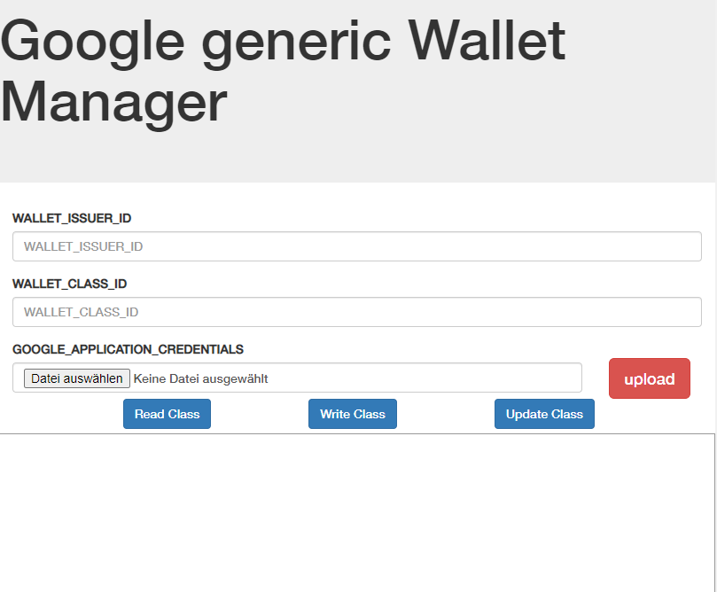

# Google generich Wallet Class Manager

This Project realized a small frontend to Manage google generic wallet classes. The Classes can be uploaded, downloaded or update.

## Installation
After clone the repository, you need to install the dependencies with **npm install**. After this you can run the server with **node app.js**. The Server runs und port 3000. To visit the Server go to [http://localhost:3000](http://localhost:3000).



Type in you Wallet Issuer ID, Your Wallet Class ID and upload your application credential json File.

## Docker Image
The application is also available as a docker container. If you prefer to use the docker container simply run:
```
docker run -it -p 3000:3000 tuttas/walletmanager
```